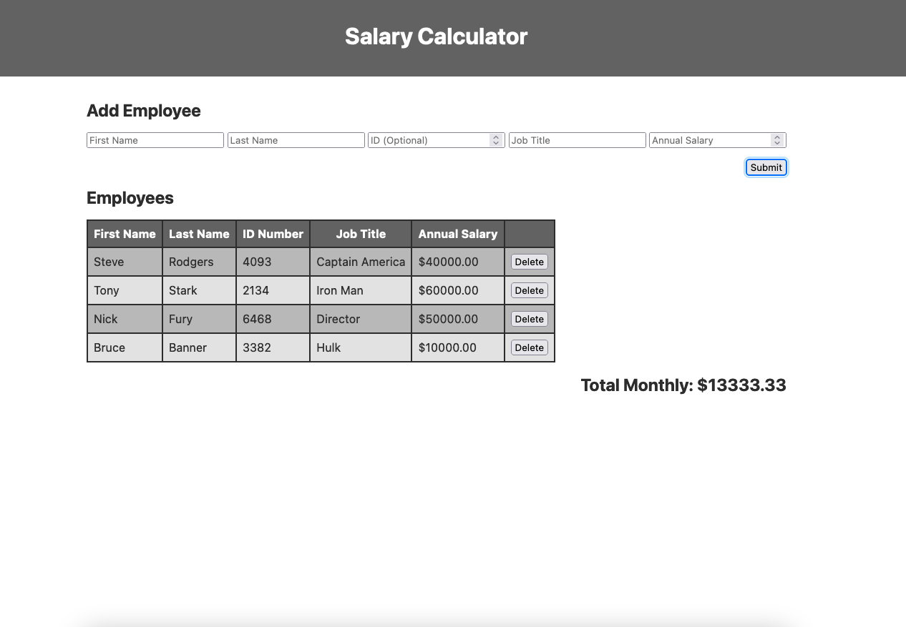

# JQuery Salary Calculator

## Description

This app is a salary calculator created for the full stack course at [Prime Digital Academy](www.primeacademy.io). The assignment was to create a form that took in 5 parameters. When submit a table row is created to hold and display these parameters. 

## Screen Shot

## Installation

To run this app simply clone this repository and run the index.html file on your machine.

## Usage
This application could be useful for any of the following:

1. Calculating monthly budgets.
2. Keeping track of employee ID's.
3. Tracking employee's annual salaries.

## Built With

- HTML5
- CSS
- Javascript

## Acknowledgement
Thanks to [Prime Digital Academy](www.primeacademy.io) who equipped and helped me to make this application a reality.

## Support
If you have suggestions or issues, please email me at [davey.meuer@gmail.com](davey.meuer@gmail.com)
